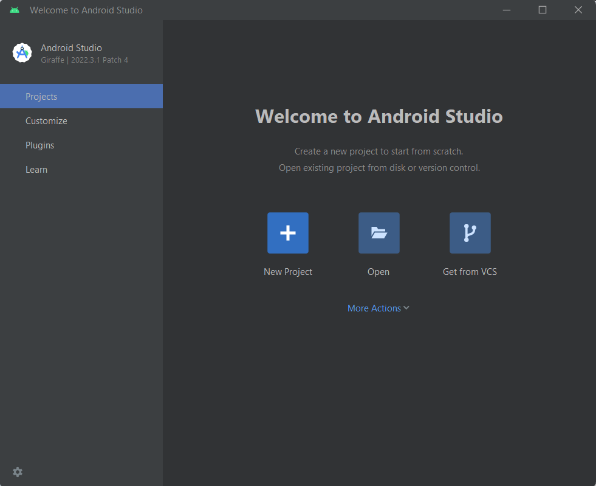
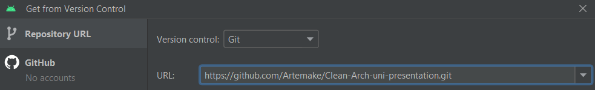
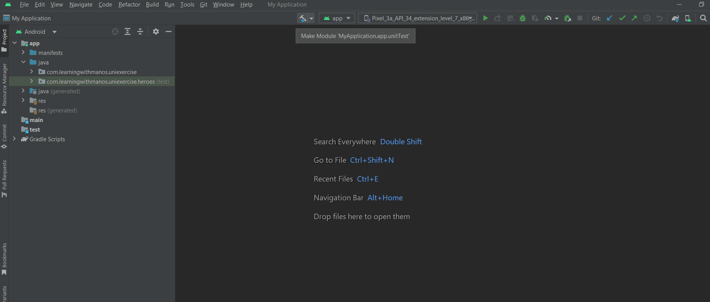
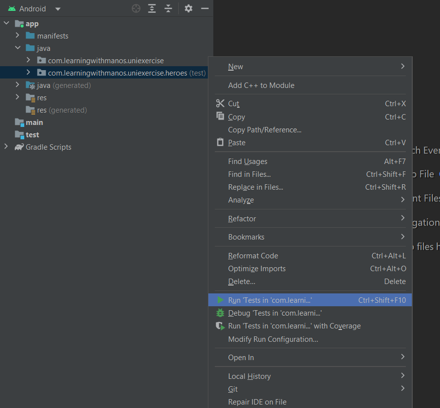

# Εγκατάσταση Android Studio και του repository
1. Κατεβάστε το Android Studio (https://developer.android.com/studio)
2. Αφού το εγκαταστείσετε και το ανοίξετε επιλέξτε Get from Version Control

3. Αν δεν έχετε εγκαταστήσει το Git, κάντε το μέσα από την επιλογή που σας δίνει το Android Studio
4. Κάντε clone το repository

5. Αφού συγχρονιστεί το project και κατεβούν οι απαραίτητες εξαρτήσεις θα πρέπει να μπορείτε να κάνετε build

6. Τρέξτε τα Test

# Ζητούμενο

Εφαρμογή που απεικονίζονται ήρωες σε μία λίστα που παίρνουμε από ένα API με τρεις διαφορετικούς τρόπους.
* Απεικόνηση της λίστας των ηρώων.
* Απεικόνηση της λίστας των ηρώων ταξινομημένη σύμφωνα με τα ονόματα σε αλφαβητική σειρά.
* Απεικόνηση της λίστας των ηρώων ταξινομημένη σε φθίνουσα σειρά σύμφωνα με αριθμό των εμφανίσεων σε κόμικ των ηρώων.

Κατά την απεικόνιση θέλουμε κάθε ήρωας να έχει το εξής format "$name, comics - $availableComics"

Tο API θα καλείται μόνο μία φορά κατά την 1η εκκίνηση της εφαρμογής, τα δεδομένα στην συνέχεια αποθηκεύονται τοπικά και σε κάθε επόμενη εκκίνηση της εφαρμογής τα δεδομένα αντλούνται από τοπικά.
